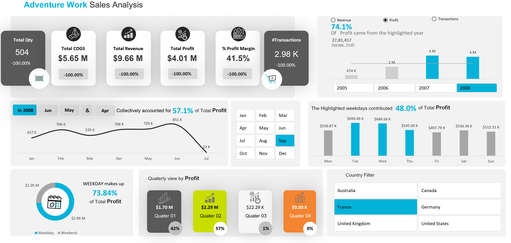

# 📊 Adventure Sales Analysis Excel Dashboard

##  Project Overview
This project showcases an interactive Sales Analytics Dashboard built using Microsoft Excel and the Adventure Works dataset. The goal was to transform raw sales data into meaningful business insights through data cleaning, modeling, and visualization techniques.

The dashboard provides a comprehensive view of sales performance, profitability, customer trends, and product analysis, helping support data-driven decision-making.

##  Key Insights
-  Sales performance analysis across multiple product categories
-  Profitability tracking and KPI monitoring
-  Customer purchasing behavior analysis
-  Product-wise sales performance evaluation
-  Time-based sales trend analysis
-  Interactive filtering and dashboard exploration using slicers

##  Tools & Technologies
- Microsoft Excel
- Power Query
- Power Pivot
- DAX (Data Analysis Expressions)
- Pivot Tables & Pivot Charts
- Interactive Dashboard Design

##  Dashboard Snapshot

##  Project Structure
- `Adventure_work_xcel_Dashboard.xlsm` → Interactive Excel Dashboard
- `dashboard-screenshot.png` → Dashboard Preview
- `README.md` → Project Documentation

##  Key Learnings
- Data cleaning and transformation using Power Query
- Data modeling with Power Pivot
- Creating DAX measures for business metrics
- Building interactive dashboards and KPI reports
- Converting raw data into actionable business insights
- Strengthening analytical thinking and data storytelling skills

##  Future Improvements
- Implement advanced DAX calculations
- Add customer segmentation analysis
- Explore automation using VBA
- Create a Power BI version of the dashboard
- Incorporate predictive sales analysis

## 🤝 About This Project
This project was developed as part of my journey in Data Analytics and Business Intelligence. I'm continuously learning and exploring new tools, techniques, and best practices to improve my analytical and problem-solving skills.
